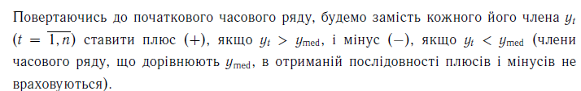

```{r import data and libraries, echo = F, include = F, comment=""}
#build plots 
library(ggplot2)

data = read.csv("data.csv")
df_org <- model_df <- fourier_df <- data.frame("Y" =  data$Y)
t_org <- data$t
w = 6
```

<!-- Add U to function -->

Y = t + 7 + 3*sin(t) + 0.14


## 1.Тести на наявнiсть тенденції


### Тест квадратiв послiдовних рiзниць (тест Аббе)

```{r test trend Abbe, echo=F, comment = "", include = T}
#Abbe-----------
n <- length(df_org$Y)
sn <- sum((df_org$Y -  mean(df_org$Y))^2)/(n-1)
qn <- sum( (df_org$Y[2:n] - df_org$Y[1:(n-1)]  )^2)/(2*(n-1))
y_qs <- qn/sn

#take table value for y_min
y_min = 0.7718
cbind("gamma_qs" = y_qs,"gamma_min" =  y_min,  ifelse(y_min > y_qs, "Tendence exist", "Does not exist"))
```

### Тест серiй, заснований на медiанi



кiлькiсть серiй $\nu (n)$ i довжину найдовшої серiї $\tau (n)$


```{r test trend meidan, echo = F, comment="", include = T }
median = median(df_org$Y)
result_vector = df_org$Y[df_org$Y != median] > median
serias <- c()
k = 1
#max = 1
for (i in 2:length(result_vector)){
  if (result_vector[i] != result_vector[i-1]){
    serias <- c(serias, k)
    k = 0
  }
  else{
    if (i == length(result_vector)){
      k = k+1 
      serias <- c(serias, k)}
  }
  k = k + 1
}
#serias

ifelse(length(serias) > 0.5 * (n + 2 - 1.96 * sqrt(n-1)),"Does not exist", "Tendence exist")
ifelse(max(serias) < 1.43 * log(n + 1), "Does not exist", "Tendence exist")
```

## 2. Обрати клас моделi---адитивна чи мультиплiкативна


## SMA -- ковзана середня

```{r SMA function, echo=F, include = F, comment=""}
SMA <- function(df, w){
  # create result col
  colnames(df) <- c("Y")
  df$sma <- (rep(NA, nrow(df)))

  # check for oddness of window
  start_index = ifelse(w %% 2 == 0,  w/2 - 1, w/2 )

  for ( i in w:nrow(df) ){
    df[start_index + (i - w + 1),2] <- mean(df[(i-w +1):i, 1])

  }

  return(df)
}
```

```{r, SMA_graph, echo = F,include = T , comment = "", warning=FALSE}
w = 6
SMA_df <- SMA(df_org, w = w)
#print(SMA_df)

ggplot()+
  geom_point(aes(x = t_org, y = SMA_df$Y))+
  geom_line(aes(x = t_org, y = SMA_df$Y))+
  scale_y_continuous(name = "Y",
                     sec.axis = sec_axis(~ ., name = "SMA")) +
  labs(x = "X") +
  theme_minimal()+
  geom_point(aes(x = t_org, y = SMA_df$sma), color = "red")+
  geom_line(aes(x = t_org, y = SMA_df$sma), color = "red")
```

CSMA - центральна ковзана середня

mcs    - Оцiнка сезонної компоненти

```{r CSMA, echo = F, comment = "", include = T}
SMA_df$csma <- rep(NA,nrow(SMA_df))
for(i in 2:nrow(SMA_df)){
  SMA_df$csma[i] <- mean(SMA_df[(i-1):i, 2])
}

SMA_df$msc <- SMA_df$Y - SMA_df$csma
SMA_df
```

## 3.Розрахуємо значення сезонної компоненти та скоригованi

```{r fix coefficient, echo = F, comment="", include = T}
#measure of seasonal component
MSC <- matrix(c(SMA_df$msc,rep(NA,4)), ncol = w, byrow = T)
print("MSC")
rbind("MSC" = MSC)
# find MSC means
MSC_means <- colMeans(MSC, na.rm = T)

# k
k = sum(MSC_means)/ w
rbind("k = " = k)

#find fix coefficient
MSC_fixed <- MSC_means - k

rbind("MSC_means" = MSC_means, "MSC_mean_fixed" = MSC_fixed)

#check
#sum(MSC_fixed) == 0
rbind("sum=" = sum(MSC_fixed))
```

## Without Fourier Series

Оцiнити чисельно тенденцiю ряду (T) та розрахувати залишки..

```{r model_df, echo = F, comment = "", include = T}
#model_df
colnames(model_df) <- c("y")

# S_t
times <- round(nrow(model_df)/ w, digits = 0)
times2 <- (nrow(model_df) - times * w )
model_df$S_t <- c(rep(MSC_fixed,times), MSC_fixed[1:times2])


model_df$yt_S = model_df$y - model_df$S_t

# find model and add T
t <- 1:nrow(model_df)
t_model <- lm(yt_S~ t, data = model_df)
model_df$T <- t_model$fitted.values
rbind(t_model$coefficient)
# epsilon (difference)
model_df$epsilon <- model_df$y - (model_df$T + model_df$S)

head(model_df)
```

### Перевiрити адекватнiсть моделi

```{r functions for testing, echo = F, comment = "", include = F}
#RS - creterion 
RS_criterion <- function(epsilon,U_min, U_max, aplha = 0.05){
  n <- length(epsilon)
  U <- (max(epsilon) - min (epsilon))/sd(epsilon)
  
  return(ifelse(U_min <= U & U <= U_max,
                "The hypothesis of normality is accepted",
                "The hypothesis of normality is NOT accepted"))
}

# Froncini criterioum B_n
Froncini_criterium  <- function(epsilon, B_kr){
  n <- length(epsilon)
  B <- 1/sqrt(n)
  for ( i in 1:n){
    B = B + abs( pnorm( scale(epsilon)[i]) - (i - 0.5)/n )
  }
  
  return(ifelse(B < B_kr,
                "The hypothesis of normality is NOT accepted",
                "The hypothesis of normality is accepted"))
}

# Test for  expected value of random component is  0 
E_test <- function(epsilon, alpha){
  #Test for  expected value of random component is  0 
  n <- length(epsilon)
  t_st <- (mean(epsilon)/sd(epsilon)) * sqrt(n)
  t_kr <- qt(1 - alpha/2, df = n-1)
  return(ifelse(abs(t_st) < t_kr , 
                "The hypothesis of the E[rand comp] is 0 is accepted",
                "The hypothesis in NOT accepted"))
}

#Durbian Watson Test for autocorecaltion of 1 lag
durbian_warson_test <- function(epsilon, d_0, d_u){
  
  l <- length(epsilon)
  
  eps_i <- epsilon[1:(l - 1)]
  eps_i_1 <- epsilon[2:l]
  
  d_st <- sum((eps_i - eps_i_1)^2)/sum(eps_i^2)
  
  if(d_st > d_u & d_st < (4 - d_u) ){
    result = cbind(0,d_0, d_u, d_st, "4 - d_u" = 4 - d_u, "4 - d_0" = 4 - d_0, 4)
    return(list(ans = "area of acceptance of the hypothesis H_0", "d_st" = d_st, "result_vec" = result))
  }
  else{
    if ((d_st < d_0) | (d_st > (4  - d_0) ) ){
      result = cbind(0,d_0, d_u, "4 - d_u" = 4 - d_u, "4 - d_0" = 4 - d_0, 4)
      return(list(ans = "area of acceptance of the hypothesis H_1", "d_st" = d_st, "result_vec" = result))
    }
    else{
      result = cbind(0,d_0, d_u, "4 - d_u" = 4 - d_u, "4 - d_0" = 4 - d_0, 4)
      return(list(ans = "areas of uncertainty", "d_st" = d_st, "result_vec" = result))
    }
  }
}
#Breusch-Godfrey test for autocorrelation for 2 lag
breusch_godfrey <- function(epsilon, alpha =0.05){
  N <- length(epsilon)
  q1 <- lm( epsilon[3:length(epsilon)] ~ epsilon[1:(length(epsilon)-2)] + epsilon[2 : (length(epsilon) - 1)])
  F_cr<- qf(1 - alpha/2, df1 = 2, df2 =  N - 2)
  F <- summary(q1)$fstatistic[1]
  ans = ifelse(F < F_cr, "autocorrelation 2 log", "no autocorrelation 2 log")
  return(list(F = F, F_cr = F_cr, ans = ans))
}

# Residual sum of squers
RSS <- function(epsilon){
  return(sum(epsilon ^ 2))
}

# MAPE
MAPE <- function(epsilon, y){
  mape = 1/length(epsilon) * sum( abs(epsilon) /  y)
  return(mape * 100) 
}

#R^2
R2 <- function(epsilon, y){
  # R^2 
  R2 <- 1 -( RSS(epsilon)/ sum((y - mean(y))^2 )    )
  return(R2)
}

#R_T 
R_T <- function(epsilon, y){
  n <- length(epsilon)
  return(1 - (1 - R2(epsilon, y)) * (n-1)/(n-2))
}


```

```{r results of testing, echo = F, comment = "", include= T}

rbind(

"Критерiй Девiда—Хартлi—Пiрсона" = RS_criterion(model_df$epsilon, 3.830, 5.350),

"Критерiй нормальностi Фроцiнi" = Froncini_criterium(model_df$epsilon, 0.2840),

"E test" = E_test(model_df$epsilon, alpha = 0.05)

)

print( durbian_warson_test(model_df$epsilon, 1.50, 1.59))

print(breusch_godfrey(model_df$epsilon))
```

### Оцiнка точностi моделi

```{r Оцiнка точностi моделi, echo = F, comment = "", include = T}
rbind(
  "Середнє квадратичне вiдхилення" = var(model_df$epsilon),
  
  "MAPE" = MAPE(model_df$epsilon, model_df$y),
  
  "Коефiцiєнт детермiнацiї R^2 " = R2(model_df$epsilon, model_df$y),
  
  "скоригованим коефiцiєнтом детермiнацiї за Тейлом" = R_T(model_df$epsilon, model_df$y)
  
  
  
)
```

## Fourier Series


```{r fourier series function, echo = F, include = F}
fourier_coefficients <- function(x, N, M) {
  # Calculate the number of data points
  #n <- length(x)
  
  # Check if the number of data points is even or odd
  if (N %% 2 == 0) {
    # Even number of data points
    a0 <- mean(x)
    
    # Calculate the Fourier series coefficients for k = 1 to M
    ak <- rep(0, M)
    bk <- rep(0, M)
    for (k in 1:M) {
      ak[k] <- (2/N) * sum(x * cos(2 * pi * k * (1:N - 1) / N))
      bk[k] <- (2/N) * sum(x * sin(2 * pi * k * (1:N - 1) / N))
    }
  } else {
    # Odd number of data points
    a0 <- (2/(N + 1)) * sum(x)
    
    # Calculate the Fourier series coefficients for k = 1 to M
    ak <- rep(0, M)
    bk <- rep(0, M)
    for (k in 1:M) {
      ak[k] <- (2/(N + 1)) * sum(x * cos(2 * pi * k * (1:N) / (N + 1)))
      bk[k] <- (2/(N + 1)) * sum(x * sin(2 * pi * k * (1:N) / (N + 1)))
    }
  }
  
  # Return the Fourier series coefficients
  return(list(a0 = a0, ak = ak, bk = bk))
}
```

Коефіцієнти ряду Фурьє

```{r fouier coeffs, echo = F, include = T, comment=""}
#window size 
M = w
# N number of elements 
N = nrow(df_org)
# find the coeeficients of fourier series  
coeffs <- fourier_coefficients(model_df$S_t, N, M)
coeffs
```

### Оцiнити чисельно тенденцiю ряду (T).

```{r fouier data frame, include = T, echo = F, comment = ""}
#fourier_df
colnames(fourier_df) <- c("y")

# S_t
times <- round(nrow(fourier_df)/ w, digits = 0) # time is going from 0,w * k
times2 <- (nrow(fourier_df) - times * w ) # times2 add from w*k, n 
fourier_df$S_t <- c(rep(MSC_fixed,times), MSC_fixed[1:times2])

# find s_hat 
for (i in 1: N){
  temp = 0
  for ( k in 1:M){
    temp <- temp + coeffs$ak[k] * cos(2 * pi * k * t_org[i]/ N) + coeffs$bk[k] * sin(2 * pi * k * t_org[i]/ N)
    
    #print(coeffs$ak[k] * cos(2 * pi * k * t_org[i]/ N))
  }
  fourier_df$S_hat[i] <- coeffs$a0/2 + temp 
  #print(coeffs$a0/2 + temp )
}

# find y_t - s_hat 
fourier_df$yt_S = fourier_df$y - fourier_df$S_hat

#Predict T by the model
t <- 1:nrow(fourier_df)
t_model <- lm(yt_S~ t, data = fourier_df)
fourier_df$T <- t_model$fitted.values
rbind(t_model$coefficient)

# epsilon (difference)
fourier_df$epsilon <- fourier_df$y - (fourier_df$T + fourier_df$S_hat)

head(fourier_df)
```

### Перевiрити адекватнiсть моделi

```{r results of testing fourier, echo = F, comment = "", include= T}
print(c(max(fourier_df$epsilon), min(fourier_df$epsilon)))
rbind(

"Критерiй Девiда—Хартлi—Пiрсона" = RS_criterion(fourier_df$epsilon, 3.830, 5.350),

"Критерiй нормальностi Фроцiнi" = Froncini_criterium(fourier_df$epsilon, 0.2840),

"E test" = E_test(fourier_df$epsilon, alpha = 0.05)

)

print( durbian_warson_test(fourier_df$epsilon, 1.50, 1.59))
print(breusch_godfrey(fourier_df$epsilon))
```

### Оцiнити точнiсть моделi за допомогою показникiв MAPE та R2.

```{r Оцiнка точностi моделi fourier, echo = F, comment = "", include = T} 
rbind("Середнє квадратичне вiдхилення" = var(fourier_df$epsilon),

"MAPE" = MAPE(fourier_df$epsilon, fourier_df$y),

"Коефiцiєнт детермiнацiї R^2" = R2(fourier_df$epsilon, fourier_df$y),

"скоригованим коефiцiєнтом детермiнацiї за Тейлом" = R_T(fourier_df$epsilon, fourier_df$y)

)
```